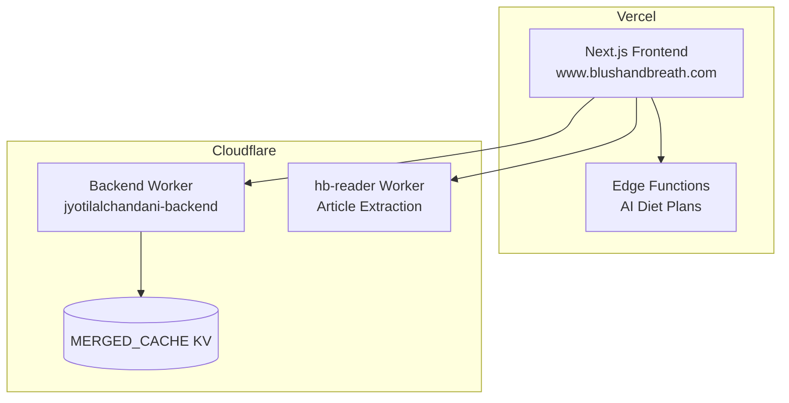

# AGENTS.md
This file provides guidance to Verdent when working with code in this repository.

## Table of Contents
1. Commonly Used Commands
2. High-Level Architecture & Structure
3. Key Rules & Constraints
4. Development Hints

## Commands
- `npm run dev` - Start development server (localhost:3000)
- `npm run build` - Build for production (also runs next-sitemap postbuild)
- `npm run lint` - Run ESLint
- `npx vercel --prod` - Deploy frontend to Vercel production
- `npx wrangler deploy --config wrangler.backend.toml --env ""` - Deploy backend worker
- `node scripts/refresh-article-data.js` - Regenerate Wikipedia/PubMed content for substance pages

## Architecture
- **Frontend**: Next.js 16 (Pages Router) on Vercel with ISR (1hr revalidation)
- **Backend**: Cloudflare Workers (`jyotilalchandani-backend`) with KV cache + Durable Objects
- **Article Reader**: `hb-reader` Cloudflare Worker (Mozilla Readability extraction)
- **AI**: Vercel Edge Functions for Gemini 2.0 Flash (diet plan generation) - CF Workers has 10ms CPU limit

- **Data Files**: `lib/data/` contains banned-substances, legal-supplements, affiliate-products, articles, buy-pages JSON
- **Indian Medicines DB**: 254K medicines in `data/indian-medicines.json` (85MB optimized)
- **Entry Points**: `pages/` for routes, `pages/api/` for serverless functions

## Key Rules & Constraints

### URL Canonicalization (Critical)
- **ALWAYS** use `https://www.blushandbreath.com` (with www)
- Never use non-www or Vercel preview URLs in sitemaps, canonical tags, OG tags, or schema markup
- Files to check: `next-sitemap.config.js`, `components/SEO/MetaHead.tsx`, `components/SEO/SchemaMarkup.tsx`

### Secrets Management
- **NEVER** commit secrets to `wrangler.backend.toml` or any source file
- Cloudflare secrets: `wrangler secret put <NAME>`
- Vercel env vars: `npx vercel env add <NAME> production` (use interactive mode, no piping)

### SEO Requirements
- Every indexable page needs: canonical URL, og:url, og:title, og:description
- `robots.txt` must allow `/_next/static/` and disallow `/api/`
- Date formatting in `getStaticProps` must use `{ timeZone: 'UTC' }` to prevent hydration mismatch
- Priority pages go in `public/sitemap-priority.xml` and are excluded from main sitemap

### Content Hubs (Pillar + Cluster Model)
- Pillar pages: `/banned/[slug]` with `isPillarPage: true` in data
- Cluster articles: `/guide/[slug]` linked via `relatedPages`
- All cluster pages must link back to pillar

### Build Constraints
- Vercel function limit: 100MB - optimized medicine data to 85MB
- Gemini API calls need 15-45s timeout - use Vercel Edge Functions, not CF Workers

## Development Hints

### Adding a New Page
1. Create file in `pages/` with `getStaticProps` for SSG/ISR
2. Add canonical URL via `MetaHead` component
3. Set `revalidate: 3600` for ISR
4. If priority page, add to `sitemap-priority.xml` and exclude from main sitemap

### Adding a New Banned Substance
1. Add entry to `lib/data/banned-substances.json` with all required fields
2. Add `wikipediaSearchTerms` for content fetching
3. Run `node scripts/refresh-article-data.js` to fetch Wikipedia/PubMed
4. Build and deploy

### Adding a New Guide Article
1. Add entry to `lib/data/articles.json` with sections, faqs, citations
2. Include `relatedPages` linking to pillar page
3. For priority articles: add to `sitemap-priority.xml`, add slug to `PRIORITY_GUIDE_SLUGS` in `next-sitemap.config.js`

### Adding Affiliate Products
1. Add to `lib/data/affiliate-products.json` with `relatedSupplements` slugs
2. Products appear automatically on related supplement/banned pages via `useAffiliateProducts` hook

### Modifying Backend RSS/Cache
1. Edit `_worker.js` (search for `parseRSSFeed`)
2. Deploy: `npx wrangler deploy --config wrangler.backend.toml --env ""`
3. Refresh cache: `curl -X POST "https://jyotilalchandani-backend.sparshrajput088.workers.dev/api/admin/refresh-news" -H "Authorization: Bearer admin123"`

### Submitting URLs to Search Engines
- Bing IndexNow key: `d8df54ad1c1949f6b6511cd1bc69a6c9` (file in `public/`)
- Google: Submit sitemap via Search Console, wait 24-48hrs for crawl
